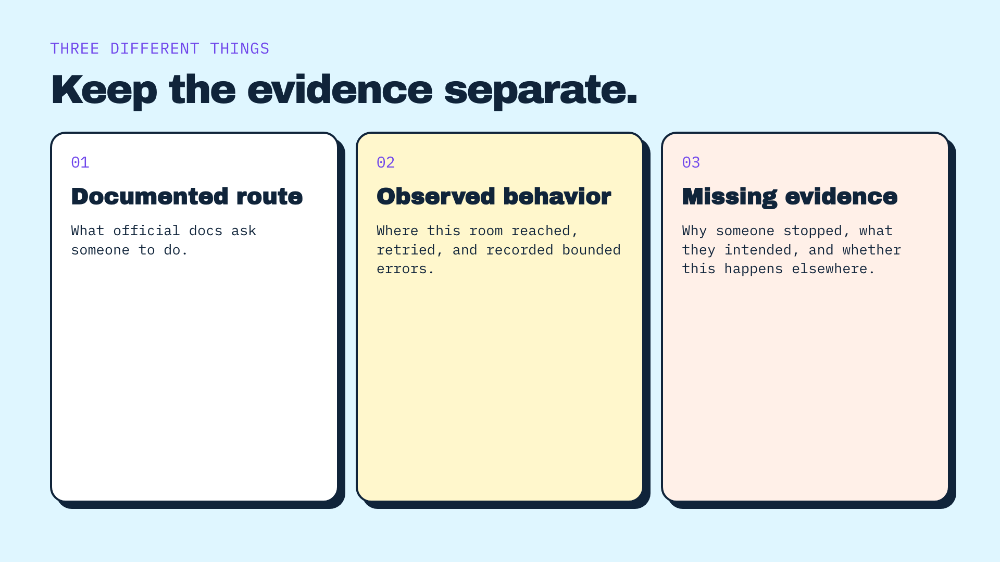
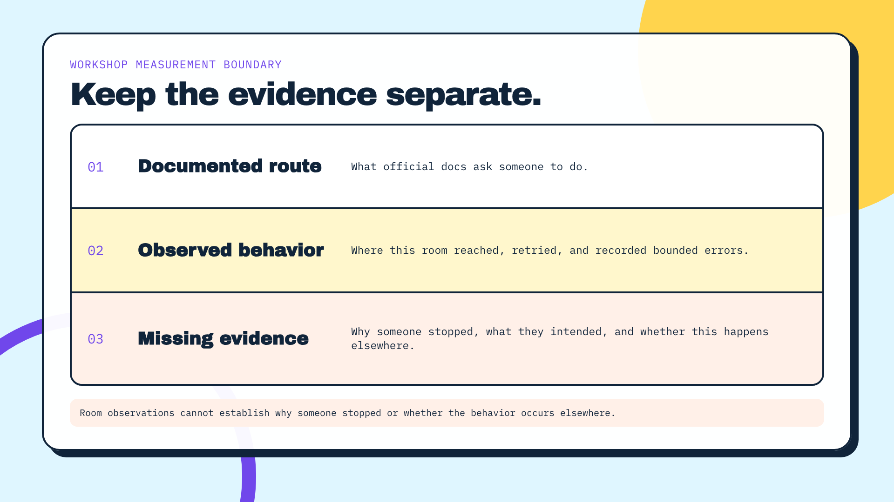
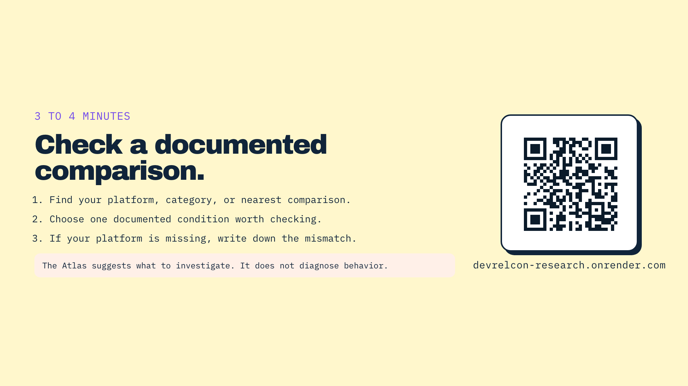
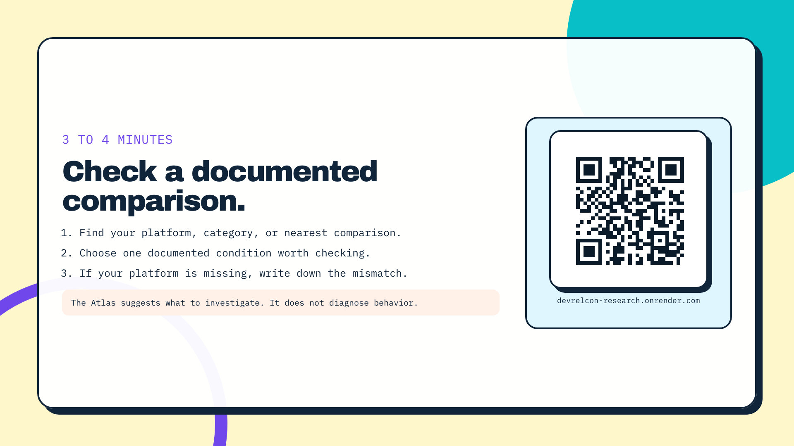
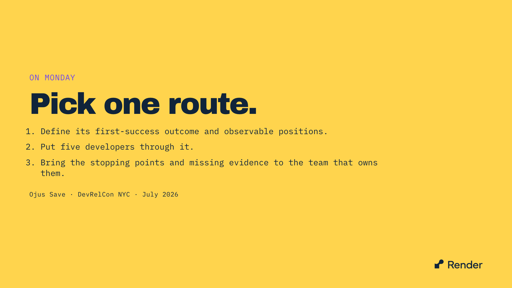
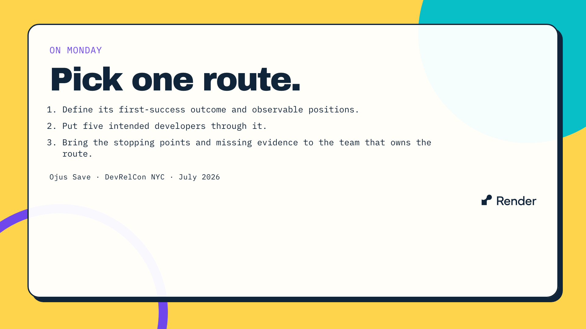

# Visual review evidence

These projector-size captures compare the previous deck with the unified visual-system pass. They are retained so the pull request review remains reproducible after its feature branch is deleted.

## Evidence boundary, slide 22

| Before | After |
| --- | --- |
|  |  |

## Atlas resource, slide 19

| Before | After |
| --- | --- |
|  |  |

## Closing action, slide 20

| Before | After |
| --- | --- |
|  |  |
